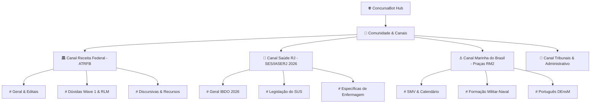

# 💡 PROPOSTA DE ARQUITETURA — GABARITO.AI COMUNIDADE & CHAT
**Status:** Arquivado / Ideia para Futura Implementação | **Nenhum código aplicado no sistema**

---

## 🎯 1. Visão Geral & Proposta de Valor

O **Gabarito.AI Community Chat** é um conceito para criar uma rede colaborativa em tempo real integrada à plataforma, onde estudantes focados no **mesmo concurso ou carreira** poderão:
1. **Trocar Dúvidas & Macetes**: Discutir pegadinhas de bancas específicas (FGV, IBDO, DEnsM).
2. **Compartilhar Questões & Flashcards**: Enviar questões do banco diretamente no chat com botão "Resolver Agora".
3. **Salas de Estudo em Grupo (Pomodoro Coletivo)**: Estudar juntos com contadores de tempo sincronizados.
4. **Tutor IA Co-Piloto no Grupo (`@GabaritoAI`)**: Marcar o bot para tirar dúvidas rápidas ou gerar enquetes ao vivo no grupo com base na base RAG de PDFs.

---

## 🏛️ 2. Arquitetura de Canais por Carreira

Os canais de chat serão estritamente isolados por concurso para manter o foco:



---

## ⚡ 3. Opções Tecnológicas de Tempo Real

| Opção | Complexidade | Custo de Servidor | Latência | Recomendação ConcursaBot |
|---|:---:|:---:|:---:|---|
| **Server-Sent Events (SSE) + REST** | Baixa | Grátis / Mínimo | ~200ms | 🟢 **Recomendada para V1** (usa apenas HTTP padrão, não precisa de servidor WebSocket separado, funciona 100% no Render/Cloudflare) |
| **WebSockets (`ws` ou `socket.io`)** | Média | Baixo | <50ms | 🟡 **Recomendada para V2** (se houver digitação em tempo real 'fulano está digitando...') |
| **Long Polling (Fetch a cada 3s)** | Mínima | Baixo | 1s - 3s | ⚪ **Fallback para conexões instáveis** |

---

## 🗄️ 4. Modelo de Dados Proposto (SQLite)

```sql
-- Canais de Conversa por Concurso
CREATE TABLE IF NOT EXISTS community_channels (
    id TEXT PRIMARY KEY,               -- ex: 'ses_rj_sus', 'atrfb_tributario'
    career_id TEXT NOT NULL,           -- 'ses_rj', 'marinha_rm2', 'atrfb'
    name TEXT NOT NULL,                -- '# Legislação do SUS'
    description TEXT,
    icon TEXT DEFAULT '💬',
    created_at DATETIME DEFAULT CURRENT_TIMESTAMP
);

-- Mensagens dos Estudantes
CREATE TABLE IF NOT EXISTS community_messages (
    id INTEGER PRIMARY KEY AUTOINCREMENT,
    channel_id TEXT NOT NULL,
    user_id TEXT NOT NULL,
    user_name TEXT NOT NULL,
    user_avatar TEXT DEFAULT '👨‍🎓',
    career_badge TEXT,                 -- 'Téc. Enfermagem', 'Analista Tributário'
    message_text TEXT NOT NULL,
    attachment_type TEXT,              -- 'question', 'flashcard', 'summary', NULL
    attachment_id INTEGER,             -- ID do item anexado
    upvotes INTEGER DEFAULT 0,
    is_pinned BOOLEAN DEFAULT 0,
    created_at DATETIME DEFAULT CURRENT_TIMESTAMP,
    FOREIGN KEY (channel_id) REFERENCES community_channels(id) ON DELETE CASCADE
);

-- Reações & Upvotes (Evita duplicação)
CREATE TABLE IF NOT EXISTS message_reactions (
    id INTEGER PRIMARY KEY AUTOINCREMENT,
    message_id INTEGER NOT NULL,
    user_id TEXT NOT NULL,
    reaction_emoji TEXT NOT NULL,      -- '🔥', '💡', '✅', '❤️'
    created_at DATETIME DEFAULT CURRENT_TIMESTAMP,
    UNIQUE(message_id, user_id, reaction_emoji),
    FOREIGN KEY (message_id) REFERENCES community_messages(id) ON DELETE CASCADE
);
```

---

## 🤖 5. Participação do Bot no Chat (`@ConcursaBot`)

Quando um usuário digita `@ConcursaBot [sua dúvida]`:
1. O backend captura a mensagem.
2. Consulta a **Base RAG dos PDFs** daquele concurso específico.
3. O Gemini 3.7 Flash formula uma resposta ultra-rápida (em bloco destacado com badge 🤖 `Tutor IA`) citando o artigo de lei ou página da apostila.
4. Gera automaticamente um botão: `[ ➕ Criar Flashcard desta Dúvida ]`.

---

## 🛡️ 6. Moderação Automática & Segurança

* **Rate Limiting**: Máximo de 1 mensagem a cada 2 segundos por IP (evita floods).
* **Sanitização XSS**: Uso do `escapeHTML()` nativo já implementado no ConcursaBot.
* **Filtro Anti-Spam com IA**: Mensagens com links externos suspeitos ou comportamento inadequado são ocultadas automaticamente.
* **Sem cadastro complexo**: Usa o próprio perfil ativo do usuário (`user_profiles`).

---

## 🎨 7. Mockup Visual da Interface (Proposta UI)

```
┌─────────────────────────────────────────────────────────────────────────────┐
│ 💬 Comunidade: SES-RJ / IASERJ 2026                 [ 👥 48 Estudando Agora ]│
├─────────────────┬───────────────────────────────────────────────────────────┤
│ CANAIS          │ # Legislação do SUS & Saúde RJ                            │
│                 ├───────────────────────────────────────────────────────────┤
│ 📌 # Geral      │ 👨‍⚕️ Carlos (Enfermagem): Alguém sabe se a IBDO costuma     │
│ > 🏥 # SUS      │    cobrar as portarias de consolidação ou só a 8.080?     │
│ 🩺 # Enfermagem │                                                           │
│ 📚 # Português  │ 🤖 ConcursaBot (Tutor IA):                                │
│ 🎯 # Simulados  │    A banca IBDO foca 85% na literalidade dos arts. 196-200│
│                 │    da CF/88 e nos arts. 6º a 9º da Lei 8.080/90.          │
│                 │    [ 📝 Ver Questão Modelo ]  [ ⚡ Salvar no Resumo ]     │
│                 ├───────────────────────────────────────────────────────────┤
│                 │ 💬 Digite sua mensagem ou marque @ConcursaBot...     [Enviar]│
└─────────────────┴───────────────────────────────────────────────────────────┘
```

---

## 📋 8. Roteiro de Implementação Futura (Quando For Aprovado)

- [ ] **Etapa 1**: Criar schema SQLite de canais e mensagens no `server/database.js`
- [ ] **Etapa 2**: Criar rotas `/api/community/channels` e `/api/community/messages`
- [ ] **Etapa 3**: Implementar stream SSE (`/api/community/stream/:channelId`) para tempo real leve
- [ ] **Etapa 4**: Criar módulo de frontend `public/js/community.js` e aba na navegação
- [ ] **Etapa 5**: Integrar gatilho `@ConcursaBot` com Gemini 3.7 Flash e RAG
